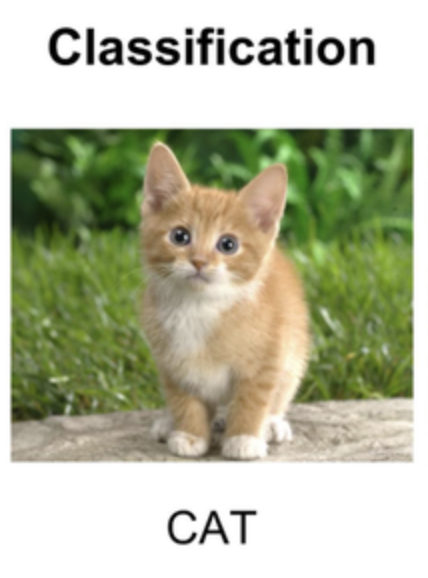

# Chapter 1: A Journey into Seeing Machines

## 1.1 What Does it Mean for a Machine to "See"?

Welcome to the fascinating world of computer vision, a field of artificial intelligence that trains computers to interpret and understand the visual world. Just as humans use their eyes and brains to make sense of their surroundings, computer vision aims to endow machines with a similar, albeit artificial, capability. At its heart, it's about transforming raw pixel data from images and videos into meaningful information that can be used to drive decisions and actions.

This journey from pixels to perception is not a single leap but a series of increasingly complex challenges. In this book, we will explore four fundamental problems that form the bedrock of modern visual understanding:

### 1.1.1 Image Classification: "What is in this image?"

The most basic task in computer vision is **Image Classification**. Given an image, the goal is to assign it a single label that describes its most prominent subject. Is this a picture of a cat, a dog, or a car? The output is a simple, categorical answer. This was one of the first major problems to be convincingly solved by deep learning, famously demonstrated by AlexNet in 2012 [1], which kicked off the revolution we will explore throughout this book.

*Figure 1.1: A simple image classification example. The model takes an image as input and outputs a single label that best describes the main subject - in this case, "CAT".*

### 1.1.2 Object Detection: "What is in this image, and where is it?"

While classification tells us *what*, **Object Detection** goes a step further to tell us *where*. The goal is to identify all objects of interest in an image and draw a bounding box around each one, along with a class label. This is a crucial step up in complexity because it requires the model to understand not just the whole scene, but the location and extent of individual objects within it. From self-driving cars identifying pedestrians to a doctor locating tumors in a medical scan, object detection is a cornerstone of many real-world applications.

*(Placeholder for an image illustrating detection: a street scene with bounding boxes around cars and pedestrians, each with a label)*

### 1.1.3 Semantic Segmentation: "What is the role of every pixel?"

**Semantic Segmentation** pushes our understanding to a much finer grain. Instead of drawing a coarse bounding box, the goal is to assign a class label to *every single pixel* in the image. Does this pixel belong to a car, a person, the road, or the sky? The output is a dense, pixel-wise map of the image, which provides a rich, detailed understanding of the scene's layout and the exact shape of each object.

*(Placeholder for an image illustrating segmentation: an image where all cars are colored blue, all pedestrians red, and the road is colored purple)*

### 1.1.4 Instance Segmentation: The Best of Both Worlds

A subtle but important extension of semantic segmentation is **Instance Segmentation**. While semantic segmentation labels all "car" pixels as one category, instance segmentation distinguishes between different instances of that category. It tells you not just that a pixel belongs to a car, but that it belongs to *Car #1* or *Car #2*. It is the ultimate combination of detection (separating objects) and segmentation (delineating them precisely).

### 1.1.5 Object Tracking: "Where are the objects going?"

Finally, when we move from static images to dynamic videos, we enter the realm of **Object Tracking**. The challenge here is to not only detect objects in each frame but also to follow them over time, maintaining a consistent identity for each one. This introduces the dimension of time and the complexities that come with it, such as handling occlusions (when an object is temporarily hidden) and re-identifying objects that reappear.

*(Placeholder for an animation/series of images illustrating tracking: a video of a busy intersection with unique colored boxes following each car and person from frame to frame)*

---

These five tasks—from the simple act of naming an image to the complex challenge of following multiple objects in a chaotic video—form the core of our journey. In the chapters that follow, we will dissect the seminal research papers that provided the breakthroughs for each, tracing the evolution of ideas from their inception to the powerful models in use today.

## 1.2 A Brief History of Seeing Machines

The quest to grant sight to machines is not a new one. It began in the earliest days of artificial intelligence, with researchers dreaming of creating a system that could mimic the human visual system. The journey has been marked by distinct eras of thought and technology.

### 1.2.1 The Era of Handcrafted Features (Pre-2012)

For decades, the dominant paradigm in computer vision was based on **feature engineering**. Researchers and engineers would spend immense effort designing sophisticated algorithms to detect specific features in images—things like edges, corners, textures, and color histograms. Foundational methods like the Harris Corner Detector [2] laid the groundwork for identifying stable interest points in an image. This led to more advanced feature descriptors like SIFT (Scale-Invariant Feature Transform) [3], SURF (Speeded-Up Robust Features) [4], and HOG (Histogram of Oriented Gradients) [5], which were then fed into classical machine learning models like Support Vector Machines (SVMs) to perform classification or detection.

This approach was powerful and led to the first generation of practical computer vision applications. However, it had a fundamental limitation: the features were brittle. They were designed for specific conditions and would often fail when faced with the variability of the real world—different lighting, viewpoints, or object deformations. The performance of the entire system was bottlenecked by the creativity and effort of the human designer.

### 1.2.2 The Deep Learning Tsunami (2012-Present)

The landscape of computer vision changed, dramatically and irrevocably, in 2012. The breakthrough came from the AlexNet paper [1], which we introduced earlier. By using a deep Convolutional Neural Network (CNN), Krizhevsky, Sutskever, and Hinton achieved a massive leap in performance on the ImageNet Large Scale Visual Recognition Challenge (ILSVRC), a prestigious competition that served as a benchmark for the field. Their error rate was less than half that of the next best competitor.

The key innovation was **representation learning**. Instead of humans designing features, the neural network *learned* the optimal features directly from the data. The first layers of the network might learn to detect simple edges and colors, subsequent layers would combine those to form more complex patterns like textures or parts of objects (noses, wheels), and the final layers would assemble those parts to recognize entire objects.

This single event triggered a tidal wave of innovation. The principles demonstrated by AlexNet were quickly applied to other areas of computer vision, leading to the family of R-CNN models for object detection, Fully Convolutional Networks for segmentation, and the many other groundbreaking papers we will study in this book. The era of handcrafted features was over, and the era of deep learning had begun.

## 1.3 How to Read This Book

This book is designed to be a comprehensive journey through the modern landscape of computer vision, but we recognize that readers come from diverse backgrounds with different goals. Whether you are a student just starting, an engineer building real-world systems, or a researcher pushing the frontiers, you can navigate this book in a way that best suits your needs.

The book is organized into five parts:

*   **Part 1: Foundations of Modern Computer Vision:** We begin by establishing the fundamental concepts of deep learning that power all modern computer vision systems.
*   **Part 2: Finding and Classifying: Object Detection:** This part is a deep dive into the core task of identifying and localizing objects, tracing the evolution from the first deep learning models to the present state-of-the-art.
*   **Part 3: Understanding the Scene: Segmentation and Matting:** Here, we move beyond bounding boxes to the fine-grained understanding of images at the pixel level.
*   **Part 4: Following the Action: Object Tracking:** We add the dimension of time, exploring the challenges and solutions for following objects in video.
*   **Part 5: Advanced Topics and Future Directions:** The final part looks at the bigger picture, exploring cross-domain topics like self-supervised learning, 3D vision, and the future trends shaping the field.

### A Guide for Your Journey

*   **For Undergraduates and Newcomers:** We recommend reading the book sequentially, at least through Parts 1, 2, and 3. Focus on the high-level concepts and the "story" of how each new idea builds upon the last. Don't worry about mastering every mathematical detail on the first pass. The goal is to build a strong conceptual map of the field.

*   **For Graduate Students:** A thorough, sequential reading is ideal. Pay close attention to the connections between different papers and the experimental results that justified each new innovation. The references at the end of each chapter are your gateways to the primary literature. Part 5 will be particularly useful for identifying potential research directions.

*   **For Industry Engineers:** You may have a specific problem to solve. While Part 1 is a crucial refresher, feel free to jump to the chapters most relevant to your work. Chapters on real-time detection (Chapter 5), efficient architectures (Chapter 6), and tracking (Part 4) are likely to be of immediate practical value. Use the other chapters as a comprehensive reference to understand the trade-offs of different approaches.

*   **For Researchers:** You may already be an expert in one of these sub-fields. We hope this book can serve as a structured and efficient way to get up to speed on adjacent areas. You can dive directly into the chapters that interest you, using the curated paper discussions and references to quickly grasp the canonical works in that domain.

No matter your path, our goal is the same: to provide a clear and intuitive understanding of how modern computer vision systems work, from the foundational theories to the cutting-edge applications. Let the journey begin.

---

## References

1.  Krizhevsky, A., Sutskever, I., & Hinton, G. E. (2012). ImageNet Classification with Deep Convolutional Neural Networks. In *Advances in Neural Information Processing Systems 25* (pp. 1097–1105). Curran Associates, Inc.
2.  Harris, C., & Stephens, M. (1988). A Combined Corner and Edge Detector. In *Proceedings of the 4th Alvey Vision Conference* (pp. 147-151).
3.  Lowe, D. G. (2004). Distinctive Image Features from Scale-Invariant Keypoints. *International Journal of Computer Vision*, 60(2), 91–110.
4.  Bay, H., Ess, A., Tuytelaars, T., & Van Gool, L. (2008). Speeded-Up Robust Features (SURF). *Computer Vision and Image Understanding*, 110(3), 346-359.
5.  Dalal, N., & Triggs, B. (2005). Histograms of Oriented Gradients for Human Detection. In *2005 IEEE Computer Society Conference on Computer Vision and Pattern Recognition (CVPR’05)* (Vol. 1, pp. 886–893).
