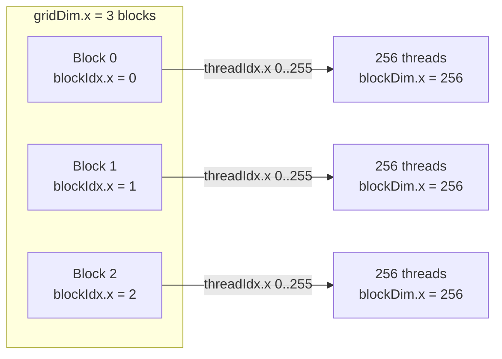
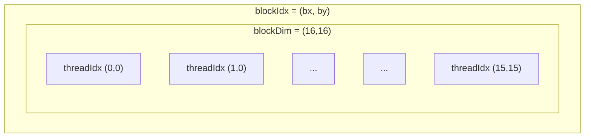

Modern GPUs deliver petaflops by letting thousands of lightweight threads execute in lockstep. To harness that power, you need to understand how your kernels are scheduled and what the hardware expects. This post walks through the vocabulary—grids, blocks, warps—and connects it to the underlying SIMD (Single Instruction, Multiple Data) architecture used by NVIDIA CUDA and similar APIs (HIP, OpenCL, Metal).

## From Scalar Code to Massive Parallelism

On a CPU, you iterate over data in a loop:

```cpp
for (size_t i = 0; i < n; ++i) {
    c[i] = a[i] + b[i];
}
```

The GPU flips this model. You launch a kernel—essentially a function—that runs across many threads simultaneously. Each thread handles one index (or a small chunk).

```cpp
__global__ void vector_add(const float* a, const float* b, float* c, size_t n) {
    size_t idx = blockIdx.x * blockDim.x + threadIdx.x;
    if (idx < n) {
        c[idx] = a[idx] + b[idx];
    }
}
```

Understanding the identifiers (`blockIdx`, `blockDim`, `threadIdx`) is the key to GPU programming.

## Grids and Blocks

- **Block**: a cooperative team of threads. NVIDIA hardware schedules blocks onto Streaming Multiprocessors (SMs). Blocks can share fast on-chip memory (`__shared__`) and synchronize with `__syncthreads()`.
- **Grid**: the collection of all blocks launched for a kernel invocation.

If you are brand new to CUDA, picture the grid as a **set of labeled boxes**. Each box is a block and holds a fixed number of **people** (threads). Every person knows two IDs:

- `blockIdx` → which box they live in.
- `threadIdx` → their seat number inside the box.

When the kernel starts, each thread computes a global ID from those two numbers and touches its own slice of data.

Launch example:

```cpp
int threads_per_block = 256;
int blocks = (n + threads_per_block - 1) / threads_per_block; // ceiling division so every element gets a thread
vector_add<<<blocks, threads_per_block>>>(d_a, d_b, d_c, n);
```

The parameters `<<<gridDim, blockDim>>>` specify how many blocks and how many threads per block you want.



### A Minimal 1D Example

Let’s shrink the numbers so the mapping is easy to see:

```cpp
const int threads_per_block = 4;
const int blocks = 3;
vector_add<<<blocks, threads_per_block>>>(d_a, d_b, d_c, 12);
```

Inside the kernel:

```cpp
size_t idx = blockIdx.x * blockDim.x + threadIdx.x;
```

Since `blockDim.x` is `4`, every time `blockIdx.x` increments, `idx` jumps by four. The table below shows the first few threads:

| blockIdx.x | threadIdx.x | Computed idx | Element processed |
|------------|-------------|--------------|-------------------|
| 0          | 0           | 0            | `a[0] + b[0]`     |
| 0          | 1           | 1            | `a[1] + b[1]`     |
| 0          | 2           | 2            | `a[2] + b[2]`     |
| 0          | 3           | 3            | `a[3] + b[3]`     |
| 1          | 0           | 4            | `a[4] + b[4]`     |
| 1          | 1           | 5            | `a[5] + b[5]`     |
| 1          | 2           | 6            | `a[6] + b[6]`     |
| 1          | 3           | 7            | `a[7] + b[7]`     |
| 2          | 0           | 8            | `a[8] + b[8]`     |
| 2          | 1           | 9            | `a[9] + b[9]`     |
| 2          | 2           | 10           | `a[10] + b[10]`   |
| 2          | 3           | 11           | `a[11] + b[11]`   |

Every element of the input vectors is covered exactly once. If `n` were not perfectly divisible by `threads_per_block`, the `if (idx < n)` guard in the kernel would prevent out-of-bounds accesses.


*A 1D grid with three blocks; each block launches 256 threads. Every thread computes a unique `idx = blockIdx.x * blockDim.x + threadIdx.x`.*

### Multi-dimensional Layouts

Both grids and blocks can be 1D, 2D, or 3D. This maps naturally onto problems like image processing:

```cpp
dim3 threads(16, 16);
dim3 blocks((width + threads.x - 1) / threads.x,
            (height + threads.y - 1) / threads.y);
process_image<<<blocks, threads>>>(...);
```

Inside the kernel, combine `blockIdx.{x,y}`, `blockDim.{x,y}`, and `threadIdx.{x,y}` to compute pixel coordinates.

### Visualizing a 2D Launch



*A 2D thread block with `blockDim = (16,16)`. Each thread computes pixel coordinates via `x = blockIdx.x * blockDim.x + threadIdx.x`, `y = blockIdx.y * blockDim.y + threadIdx.y`.*

To see how this plays out on a small image, suppose you launch 2×2 blocks of size 2×2 threads to process a 4×4 grayscale grid:

- Block `(0,0)` handles pixels `(0..1, 0..1)`
- Block `(1,0)` handles `(2..3, 0..1)`
- Block `(0,1)` handles `(0..1, 2..3)`
- Block `(1,1)` handles `(2..3, 2..3)`

Within block `(1,0)`, thread `(0,1)` computes:

```cpp
int x = blockIdx.x * blockDim.x + threadIdx.x; // 1 * 2 + 0 = 2
int y = blockIdx.y * blockDim.y + threadIdx.y; // 0 * 2 + 1 = 1
```

so it reads/writes the pixel at `(x=2, y=1)`. Thinking in terms of **block origin + thread offset** keeps the mapping intuitive as you scale to larger images or multi-channel tensors.

## Warps and SIMD Execution

- A **warp** is a scheduling unit of 32 threads (on recent NVIDIA GPUs). AMD calls the equivalent a **wavefront** (64 threads).
- All threads in a warp execute the same instruction at the same time (SIMD / SIMT). Divergent branches (per-thread `if` statements) cause serialization within the warp.

Implications:

- Align work so each warp follows the same control flow.
- Use warp-friendly memory access: consecutive threads should load consecutive addresses (coalesced access).
- When using loops or shared memory, consider warp size to avoid bank conflicts.

## Memory Hierarchy at a Glance

- **Registers**: fastest, private to each thread.
- **Shared memory**: on-chip scratchpad per block (~48–100 KB). Low latency, manual control.
- **Global memory**: device DRAM. High latency; minimize random access.
- **Constant/texture memory**: read-only caches optimized for broadcast or spatial locality.

Performance tips:

- Stage data from global to shared memory when multiple threads reuse it.
- Use `__syncthreads()` to ensure shared memory writes complete before other threads read.
- Prefer structure-of-arrays (SoA) layouts for coalesced loads over array-of-structures (AoS).

## Example: Tiling Matrix Multiply

```cpp
__global__ void matmul_tiled(const float* A, const float* B, float* C,
                             int M, int N, int K) {
    __shared__ float tile_A[32][32];
    __shared__ float tile_B[32][32];

    int row = blockIdx.y * 32 + threadIdx.y;
    int col = blockIdx.x * 32 + threadIdx.x;

    float acc = 0.0f;
    for (int tile = 0; tile < (K + 31) / 32; ++tile) {
        int tile_col = tile * 32 + threadIdx.x;
        int tile_row = tile * 32 + threadIdx.y;
        if (row < M && tile_col < K)
            tile_A[threadIdx.y][threadIdx.x] = A[row * K + tile_col];
        else
            tile_A[threadIdx.y][threadIdx.x] = 0.0f;
        if (tile_row < K && col < N)
            tile_B[threadIdx.y][threadIdx.x] = B[tile_row * N + col];
        else
            tile_B[threadIdx.y][threadIdx.x] = 0.0f;

        __syncthreads();

        for (int k = 0; k < 32; ++k) {
            acc += tile_A[threadIdx.y][k] * tile_B[k][threadIdx.x];
        }

        __syncthreads();
    }

    if (row < M && col < N) {
        C[row * N + col] = acc;
    }
}
```

- Block size is `32x32`, matching warp multiples.
- Shared memory tiles hold submatrices of `A` and `B`.
- Synchronization ensures all threads load before compute.
- The loop over `k` reuses data, reducing global memory traffic.

## Occupancy and Scheduling

**Occupancy** measures how many warps can reside on an SM at once:

- Higher occupancy improves latency hiding but isn't everything—memory bandwidth or compute intensity might be the real bottleneck.
- Registers per thread and shared memory per block limit occupancy.
- Use profiling tools (`nvprof`, Nsight Compute, `nvcc --ptxas-options=-v`) to check register usage and occupancy.

Rules of thumb:

- Keep block sizes as multiples of 32.
- Launch enough blocks to cover all SMs (at least as many blocks as SMs × 2).
- Balance shared memory usage against the number of resident blocks.

## Beyond CUDA: HIP, SYCL, and Metal

The grid/block/warp abstraction appears across ecosystems:

- **HIP** (AMD) mirrors CUDA APIs for portability.
- **SYCL/DPC++** uses `nd_range` (global range) and `group` (work-group) to express the same concepts.
- **Metal / Vulkan Compute** describe threadgroups and invocations with similar semantics.

Once you internalize CUDA's terminology, jumping between frameworks is mostly a matter of renaming.

## Checklist for Kernel Design

- Map each data element to a thread; ensure the total threads cover the input.
- Choose block dimensions that fit the hardware limits (~1024 threads/block on many GPUs).
- Align memory access for coalescing; favor SoA layouts.
- Minimize divergence; group similar work per warp.
- Profile, inspect occupancy, and tune shared memory tiling only after establishing correctness.

## Further Exploration

- NVIDIA CUDA Programming Guide (latest version).
- Mark Harris, *Optimizing Parallel Reduction in CUDA*, 2007.
- Paulius Micikevicius, *3D Finite Difference Computation on GPUs using CUDA*, 2009.
- Harris & Garland, *Structure of Arrays vs. Array of Structures*, 2012.
- SYCL 2020 specification for cross-vendor GPU kernels.

Understanding grids, blocks, and warps transforms GPU programming from trial-and-error into a reproducible craft. Start with simple kernels, look at how they schedule across the device, then iterate with profiling. The payoff is massive—video processing, deep learning, and scientific simulations all thrive when you reason in terms of SIMT execution.
