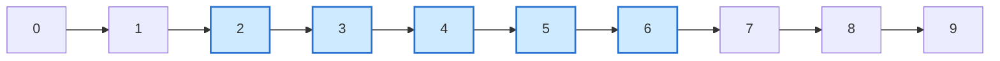
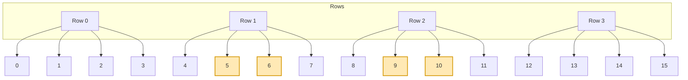
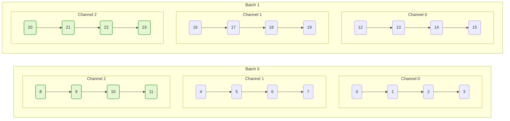

Tensor indexing feels natural once you see how dimensions line up. This walkthrough starts with 1D arrays and climbs to N-dimensional tensors, highlighting how PyTorch treats slices as **views** (no copies) and how to mutate data safely. To keep the shape intuition crisp, we pair each example with a small diagram illustrating axes and selected elements.

## 1D Vectors: The Basics

```python
import torch

x = torch.arange(10)  # tensor([0, 1, 2, 3, 4, 5, 6, 7, 8, 9])
print(x[0])           # scalar tensor(0)
print(x[-1])          # tensor(9)
print(x[2:7])         # tensor([2, 3, 4, 5, 6])
```



**Mutation:** slices share storage. Modify a slice and the original vector updates.

```python
view = x[2:5]
view[:] = 42
print(x)
# tensor([ 0,  1, 42, 42, 42,  5,  6,  7,  8,  9])
```

Use `.clone()` if you need a detached copy.

## 2D Matrices: Rows, Columns, and Ranges

```python
M = torch.arange(16).reshape(4, 4)
# tensor([[ 0,  1,  2,  3],
#         [ 4,  5,  6,  7],
#         [ 8,  9, 10, 11],
#         [12, 13, 14, 15]])

print(M[1, 2])    # element at row 1, col 2 -> tensor(6)
print(M[1])       # entire row 1 -> tensor([4, 5, 6, 7])
print(M[:, 2])    # entire column 2 -> tensor([ 2,  6, 10, 14])
print(M[1:3, 1:3])
# tensor([[5, 6],
#         [9, 10]])
```



**In-place ops:** broadcast across selected regions.

```python
M[:, 2] = torch.tensor([100, 200, 300, 400])
```

The third column updates in one shot.

## 3D Tensors: Batches + Channels + Spatial

Model data often batches 2D data. Consider `BCH` (batch, channel, height) or `BCHW` with width included.

```python
T = torch.arange(2 * 3 * 4).reshape(2, 3, 4)
# shape: (batch=2, channel=3, width=4)

sample0 = T[0]          # shape (3, 4)
channel2 = T[:, 2, :]   # all batches, channel index 2 -> shape (2, 4)
slice_hw = T[:, :, 1:3] # drop first and last column -> shape (2, 3, 2)
```



Above, channel index `2` across both batches is highlighted.

## Boolean Masks and Fancy Indexing

```python
mask = M > 10
print(M[mask])  # tensor([11, 12, 13, 14, 15])
```

Boolean masks flatten the result; positions that satisfy the predicate are returned in a 1D tensor.

"Fancy" indexing with integer sequences lets you pick arbitrary rows/columns:

```python
rows = torch.tensor([0, 3])
cols = torch.tensor([1, 2])
print(M[rows])   # rows 0 and 3
print(M[:, cols])
# columns 1 and 2 -> shape (4, 2)
```

## Ellipsis for High Dimensions

The `...` placeholder fills in as many dimensions as needed:

```python
N = torch.randn(4, 3, 5, 5)  # e.g., batch, channel, height, width

# select channel 1 across all batches and spatial locations
channel1 = N[:, 1, ...]      # shape (4, 5, 5)

# zero the bottom-right quadrant
N[..., 2:, 2:] = 0
```

This keeps code readable when tensors grow beyond three dimensions.

## Mutating with Index_add_ and Scatter

```python
weights = torch.zeros(5)
indices = torch.tensor([0, 2, 2, 4])
updates = torch.tensor([1.0, 0.5, 1.5, 2.0])

weights.index_add_(0, indices, updates)
# tensor([1., 0., 2., 0., 2.])
```

`index_add_` accumulates values at the specified indices. `scatter_` performs targeted writes:

```python
result = torch.zeros(3, 4)
src = torch.tensor([[1, 2], [3, 4], [5, 6]])
indices = torch.tensor([[0, 2], [1, 0], [2, 1]])
result.scatter_(1, indices, src)
```

Now column indices `[0,2]`, `[1,0]`, `[2,1]` receive the values from `src`.

## Beware of Non-Contiguous Views

Slicing followed by transpose can produce non-contiguous tensors. Some ops require contiguous memory; fix with `.contiguous()` or `.clone()`:

```python
view = M[:, ::2]       # stride step 2
transposed = view.t()  # transpose
if not transposed.is_contiguous():
    transposed = transposed.contiguous()
```

## Quick Reference

| Pattern | Result | Notes |
|---------|--------|-------|
| `tensor[i]` | Scalar/Vetor | Drops first dimension |
| `tensor[:, j]` | 1D slice | Keeps dimension count unless squeezed |
| `tensor[a:b, c:d]` | 2D view | Shares storage |
| `tensor[..., k]` | Works on last axis | Good for high-dimensional data |
| `tensor[mask]` | 1D tensor | Mask must match shape |
| `tensor[index_tensor]` | Fancy indexing | Returns copy |
| `.index_add_`, `.scatter_` | In-place mutation | Broadcast rules apply |

PyTorch indexing is flexible because it mirrors NumPy's semantics but adds GPU-friendly views. With a mental picture of axes—conjured by simple diagrams—selecting, slicing, and mutating becomes routine, even for large neural network tensors.
