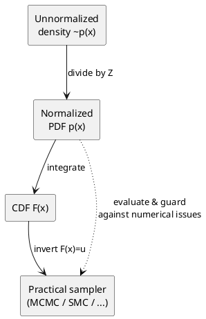

Directly sampling from a probability density function (PDF) or probability mass function (PMF) sounds deceptively simple: evaluate the function, interpret the number, and draw a random value accordingly. In practice, that workflow fails because a density or mass function only provides relative likelihoods, not a mechanical procedure for generating values with those likelihoods. If you need a refresher on how randomness is structured, start with ["Random vs Stochastic: Clarifying Variables, Processes, Sampling, and Optimization"]({{ "/2025/03/05/random-vs-stochastic-foundations/" | relative_url }}), and if you want a broader sampling tour, revisit ["Stochastic Processes and the Art of Sampling Uncertainty"]({{ "/2025/02/21/stochastic-processes-and-sampling/" | relative_url }}). With that context in hand, this post dissects the major theoretical obstacles to direct sampling and surveys the standard workarounds.

## Visual Map: From Density to Samples

> PlantUML blocks are rendered as plain text by default with GitHub Pages + kramdown. To visualize the diagram, run PlantUML locally (e.g., `plantuml file.md`) or integrate a build step/Jekyll plugin that converts the block into an image during site generation.

This schematic highlights the two major choke points: computing the normalizing constant $Z$ and inverting the CDF. Both steps must succeed before you can reach a dependable sampling routine, which is why so many practical methods focus on approximations or indirect constructions.

> PlantUML blocks are rendered as plain text by default with GitHub Pages + kramdown. To visualize the diagram, run PlantUML locally (e.g., `plantuml file.md`) or integrate a build step/Jekyll plugin that converts the block into an image during site generation.

## Why the CDF Is the Essential Bridge

The cumulative distribution function (CDF) $F(x)$ converts local density information into cumulative probability: $F(x) = \Pr(X \le x)$. With the CDF in hand, three core tasks become straightforward.

1. **Range probabilities.** For any interval $[a, b]$, \(\Pr(a \le X \le b) = F(b) - F(a)\). Computing the same quantity directly from the PDF requires evaluating an integral every time.
2. **Quantiles and percentiles.** The median solves $F(x) = 0.5$, the $p$-th percentile solves $F(x) = p$. Quantile functions are indispensable in finance, education, and risk analysis, yet most PDFs do not deliver them without the CDF.
3. **Inverse transform sampling.** To generate a random variate, draw $u \sim \text{Uniform}(0,1)$ and solve $F(x) = u$. This produces a sample with exactly the target distribution, but it only works when both $F$ and $F^{-1}$ are tractable.

The fact that so many PDFs lack a usable CDF (let alone a closed-form inverse) is the first fundamental barrier to direct sampling.

## Obstacle 1: Normalization Constants

Many statistical models define an unnormalized density \(\tilde{p}(x)\) whose integral is unknown. The actual PDF is
\[
p(x) = \frac{\tilde{p}(x)}{Z}, \qquad Z = \int \tilde{p}(x)\,dx.
\]
The constant $Z$—often called the partition function or evidence—ensures that the total probability integrates to one. Without $Z$, $p(x)$ is not a legitimate probability distribution, and neither the CDF nor any sampling method that relies on normalization can be constructed.

A quick discrete analogy highlights why $Z$ matters. Suppose a survey records counts $(60, 30, 10)$ for three outcomes. The vector captures relative popularity but sums to 100, not 1. Dividing each count by 100 produces $(0.6, 0.3, 0.1)$, a valid PMF. Continuous distributions behave the same way: $Z$ rescales a proportional density into a true PDF. Unfortunately, computing $Z$ is intractable for high-dimensional or highly structured models, which is why algorithms such as Markov chain Monte Carlo (MCMC) are designed to work with ratios of probabilities in which $Z$ cancels.

## Obstacle 2: Inverting the CDF

Even when $Z$ is known and $F(x)$ can be computed numerically, there may be no closed-form expression for $F^{-1}$. The standard normal distribution is the textbook example: its CDF involves the error function, and the inverse requires iterative numerical solvers. Each solver introduces computational cost, convergence conditions, and potential numerical instability. Relying on such a procedure for every sample undermines the notion of "direct" sampling.

## Obstacle 3: High Dimensionality

For multivariate distributions, the state space grows exponentially with dimension. Partitioning each of $d$ variables into $k$ bins yields $k^d$ cells, most of which have negligible probability mass. Enumerating or integrating over this space to build a CDF is computationally hopeless beyond modest $d$. This is the curse of dimensionality: naive strategies that might work in one or two dimensions break down completely in large parameter spaces.

## Obstacle 4: Proposal Bounds for Rejection Sampling

Acceptance–rejection sampling is sometimes presented as an alternative "direct" technique. It requires a proposal distribution $q(x)$ and a constant $M$ such that $p(x) \le M q(x)$ for all $x$. For complex targets, finding such a global bound is extremely difficult. If $M$ is chosen conservatively large, the acceptance rate collapses; if $M$ is too small, the inequality fails and the algorithm becomes invalid. Adaptive variants (slice sampling, adaptive rejection sampling) ease the tuning burden but still hinge on structural assumptions about $p(x)$.

## Obstacle 5: Geometric Constraints

Many distributions live on constrained manifolds rather than the full Euclidean space: probability simplices, positive-definite matrices, spheres, or other manifolds with non-trivial geometry. A PDF is often specified in ambient coordinates that ignore those constraints. To sample directly, one must respect the geometry through reparameterization, Jacobian corrections, and sometimes Riemannian metrics. These adjustments complicate any attempt to turn density evaluations into samples.

## Obstacle 6: Numerical Stability

Evaluating PDFs in the far tails can underflow to zero; evaluating sharp peaks can overflow. Practical implementations use log densities, rescaling, or arbitrary-precision arithmetic to avoid these issues. Each fix adds computational overhead and introduces opportunities for bias if applied inconsistently. Direct sampling procedures that repeatedly evaluate the PDF must guard against these numerical hazards.

## Practical Workarounds

Because the obstacles above are pervasive, practitioners rely on indirect sampling methods tailored to specific trade-offs:

- **Markov chain Monte Carlo (MCMC):** Generates a correlated sequence whose stationary distribution matches $p(x)$ without requiring $Z$.
- **Sequential Monte Carlo (SMC):** Propagates a population of particles with importance weights and resampling, suitable for dynamic models.
- **Variational inference:** Optimizes over a tractable family to approximate $p(x)$, trading sampling for optimization.
- **Normalizing flows and diffusion models:** Learn invertible transformations or stochastic processes that map simple base distributions to the target.

These techniques exist precisely because evaluating a density function is not the same as drawing from it. They connect directly to the workflows outlined in the broader sampling survey above, the theory-to-practice tour in ["Beyond Basics: Importance, Gibbs, and Stratified Sampling"]({{ "/2025/02/22/advanced-sampling-techniques/" | relative_url }}), and the filtering pipelines explored in ["Stochastic Processes and the Art of Sampling Uncertainty"]({{ "/2025/02/21/stochastic-processes-and-sampling/" | relative_url }}) as well as the Bayesian inference tools threaded through the [Kalman filtering series]({{ "/2024/09/20/introduction-to-kalman-filtering/" | relative_url }}). Each provides probabilistic guarantees under its own assumptions, but none resurrect the myth of effortless direct sampling.

## Takeaway

A PDF or PMF encodes relative likelihoods, not samples. Turning those likelihoods into random draws requires normalization constants, cumulative probabilities, and often intricate numerical machinery. The theoretical barriers—unknown partition functions, intractable inverses, high dimensionality, bounding difficulties, geometric constraints, and numerical instability—explain why modern statistics leans so heavily on indirect sampling algorithms. Direct sampling remains the exception, not the rule.

---

*Published on 2025-10-04.*
