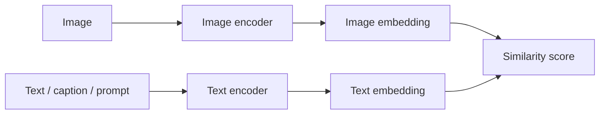
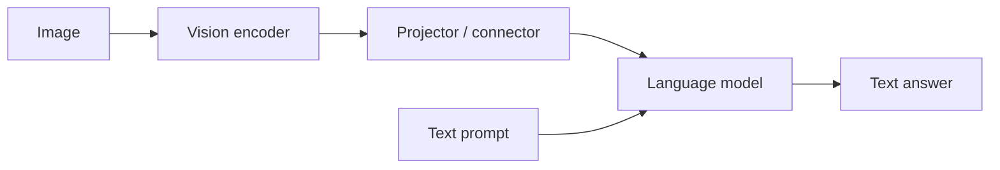

A **vision-language encoder** is a model trained so that images and text can be represented in a shared semantic space. The core promise is simple:

> An image of a dog and the phrase “a photo of a dog” should land near each other, while unrelated image-text pairs should land farther apart.

That idea sounds like retrieval, but it changed computer vision more broadly. Once a visual representation is aligned with language, the model can classify unseen labels, search images by text, support open-vocabulary recognition, and act as the visual front end for larger multimodal systems.

Vision-language encoders sit between ordinary vision encoders and full vision-language models. They usually **encode**; they do not usually **reason conversationally** or generate long answers by themselves.

## The basic architecture

The standard CLIP-style design has two towers:

The image encoder may be a ResNet, ViT, ConvNeXt, or another visual backbone. The text encoder is usually a Transformer. Each tower produces a vector in the same embedding dimension, often normalized to unit length.

For an image $x$ and text $t$:

$$
z_x = \frac{f_\theta(x)}{\lVert f_\theta(x)\rVert_2},
\qquad
z_t = \frac{g_\phi(t)}{\lVert g_\phi(t)\rVert_2}.
$$

### Normalization example: a dog photograph and a text query

Consider a real retrieval task: the image $x$ is a photograph of a golden
retriever, and the text $t$ is the prompt “a photo of a dog.” A CLIP
ViT-B/32 checkpoint maps both inputs to vectors with size $512$:

$$
f_\theta(x)\in\mathbb{R}^{512},
\qquad
g_\phi(t)\in\mathbb{R}^{512}.
$$

The model does not manually set the vector values. They are produced by the
image and text towers. Normalization divides each complete vector by its own
L2 length:

$$
z_x=\frac{f_\theta(x)}{\lVert f_\theta(x)\rVert_2},
\qquad
z_t=\frac{g_\phi(t)}{\lVert g_\phi(t)\rVert_2}.
$$

Thus, the two $512\times1$ outputs remain $512\times1$ vectors after
normalization; only their lengths change to $1$. The actual values depend on
the image, prompt, and checkpoint. They can be obtained directly from a
working CLIP model:


import torch
from PIL import Image
from transformers import CLIPModel, CLIPProcessor

model_id = "openai/clip-vit-base-patch32"
model = CLIPModel.from_pretrained(model_id)
processor = CLIPProcessor.from_pretrained(model_id)

image = Image.open("golden-retriever.jpg")
inputs = processor(
  text=["a photo of a dog", "a photo of a car"],
  images=image,
  return_tensors="pt",
  padding=True,
)

with torch.no_grad():
  image_vector = model.get_image_features(pixel_values=inputs["pixel_values"])
  text_vectors = model.get_text_features(
    input_ids=inputs["input_ids"],
    attention_mask=inputs["attention_mask"],
  )

z_x = image_vector / torch.linalg.vector_norm(
  image_vector,
  dim=-1,
  keepdim=True,
)
z_t = text_vectors / torch.linalg.vector_norm(
  text_vectors,
  dim=-1,
  keepdim=True,
)
similarities = z_x @ z_t.T

print(image_vector.shape)  # torch.Size([1, 512])
print(text_vectors.shape)  # torch.Size([2, 512])
print(z_x.norm(dim=-1))     # tensor([1.])
print(z_t.norm(dim=-1))     # tensor([1., 1.])
print(similarities)         # score for dog prompt and car prompt


The image is compared with both normalized text vectors. If the golden
retriever image matches the first prompt better, then

$$
z_x^\mathsf{T}z_{\text{dog}}
>
z_x^\mathsf{T}z_{\text{car}}.
$$

Because both vectors have unit length, each dot product is a cosine
similarity. Normalization makes the comparison depend on the direction of the
embeddings rather than on their raw magnitudes.

The compatibility score is usually a scaled dot product:

$$
s(x,t)=\alpha z_x^\mathsf{T}z_t.
$$

The output is not a sentence. It is an embedding, a similarity score, or a ranking over candidate texts or images.

## What input do they take?

### Image input

The image side usually takes a processed RGB image:

- resize or crop to a fixed resolution;
- normalize pixel values with the checkpoint's expected mean and standard deviation;
- split into patches if the image tower is a ViT;
- produce a pooled image representation or a sequence of visual tokens.

For a CLIP-like dual encoder, the final pooled image embedding is the most important deployment output. Some newer models also expose patch features for localization or dense transfer.

### Text input

The text side takes tokenized natural language:

- captions from image-text pairs during pretraining;
- prompts such as “a photo of a {label}” for zero-shot classification;
- search queries for retrieval;
- class descriptions or attribute phrases for open-vocabulary systems.

Prompt wording matters because the model was trained on natural language, not on raw class IDs. “A photo of a dog” and “dog” may produce different text embeddings.

### Paired training data

The training example is usually an image-caption pair:

$$
(x_i, t_i).
$$

The pair may come from web alt-text, curated caption datasets, synthetic captions, multilingual captions, or filtered image-text corpora. Data quality matters enormously: noisy captions teach noisy alignment.

## What output do they emit?

Vision-language encoders usually emit one or more of these:

| Output | Shape / type | Used for |
|---|---|---|
| Image embedding | one vector per image | retrieval, clustering, zero-shot classification |
| Text embedding | one vector per prompt or caption | retrieval, class prototypes, prompt matching |
| Similarity matrix | image-text scores | training loss, ranking, contrastive matching |
| Patch/token features | grid or sequence of features | localization, adapters, VLM visual tokens |
| Logits over prompts | scores against class text | zero-shot classification |

This is why a CLIP-style model can classify without a learned classifier head. Encode the image once, encode several class prompts, then choose the text prompt with the highest similarity:

$$
\hat{y} = \arg\max_c \; z_x^\mathsf{T} z_{t_c}.
$$

The class labels become language queries.

## How are they trained?

### 1. Contrastive image-text learning

CLIP-style training starts with a batch of $B$ matched image-text pairs. The image encoder produces embeddings $z^I_i$ and the text encoder produces embeddings $z^T_i$. The model builds a $B\times B$ similarity matrix:

$$
S_{ij}=\alpha (z^I_i)^\mathsf{T}z^T_j.
$$

The diagonal contains the intended matches. Off-diagonal entries are treated as negatives. A simplified image-to-text loss is:

$$
\mathcal{L}_{I\rightarrow T}
= -\frac{1}{B}\sum_i
\log\frac{\exp(S_{ii})}{\sum_j\exp(S_{ij})}.
$$

CLIP usually also applies the symmetric text-to-image direction:

$$
\mathcal{L}=\frac{1}{2}\left(\mathcal{L}_{I\rightarrow T}+\mathcal{L}_{T\rightarrow I}\right).
$$

This objective does not require human class labels. The caption supplies weak semantic supervision.

### 2. Sigmoid pairwise objectives

[SigLIP]({{ site.baseurl }}/Research/2023/SigLIP%20Sigmoid%20Loss%20for%20Language%20Image%20Pre-Training%20(2023).html) changes the objective from batchwise softmax competition to pairwise binary matching. Each image-text pair is classified as match or non-match:

$$
\mathcal{L}=\frac{1}{B^2}\sum_{i,j}
\log\left(1+\exp(-y_{ij}S_{ij})\right),
$$

where $y_{ij}=1$ for matched pairs and $-1$ otherwise.

The deployment shape is still similar: image embedding, text embedding, similarity score. The training geometry changes.

### 3. Captioning and generative losses

Some vision-language systems train the visual representation through caption generation or image-conditioned language modeling. Instead of only asking whether an image and caption match, the model predicts caption tokens:

$$
p(t\mid x)=\prod_k p(t_k\mid t_{<k}, x).
$$

This is closer to a full VLM. It encourages the representation to support language generation, not only retrieval. BLIP-style systems mix contrastive learning, image-text matching, and captioning objectives.

### 4. Distillation and improved captions

Modern variants often add:

- synthetic captions from stronger captioners;
- multilingual captions;
- teacher-student distillation;
- image-only self-supervised losses;
- localization or dense-feature objectives.

[SigLIP2]({{ site.baseurl }}/Research/2025/SigLIP%202%20Multilingual%20Vision-Language%20Encoders%20with%20Improved%20Semantic%20Understanding%20Localization%20and%20Dense%20Features%20(2025).html) is a good example: the model keeps the efficient SigLIP-style interface but improves multilingual, semantic, localization, and dense-feature behavior through a richer training recipe.

## What problem did they solve?

Before vision-language encoders, most image classifiers had a fixed label space. If a model was trained on ImageNet classes, it could classify those classes. A new category required collecting labels and training a new head.

Vision-language encoders changed the interface:

- labels can be written as text;
- retrieval can use natural-language queries;
- a dataset's categories do not need to be known at pretraining time;
- visual representations can be transferred through prompts;
- downstream systems can ask “what” questions with language.

The model is still not magic. It can only align concepts represented in its training data and captured by its encoders. But the interface is much more flexible than a fixed classifier.

## How they are used

### Zero-shot classification

Create prompts for each label:

- “a photo of a cat”;
- “a photo of a dog”;
- “a photo of a microscope slide showing carcinoma.”

Encode each prompt, compare the image embedding to each text embedding, and choose the highest score. Prompt ensembling averages several phrasings per class.

### Image-text retrieval

Encode a database of images once. Encode a user query at search time. Rank images by cosine similarity. This is the basic architecture behind many semantic image-search systems.

### Open-vocabulary detection and segmentation

Vision-language encoders often supply semantic categories to another spatial model. A detector or segmenter localizes regions, while CLIP-like embeddings decide whether a region matches a text concept.

This is why systems often pair models:

- CLIP or SigLIP for **what**;
- SAM or a detector for **where**;
- a language model for **reasoning or instruction following**.

### Visual tower for a VLM

Many VLMs use a vision encoder as the front end:

The vision encoder emits visual tokens or pooled features. A connector projects those features into the language model's token dimension. The language model then performs instruction following, dialogue, reasoning, or generation.

This is the key difference between a vision-language encoder and a full VLM: the encoder provides aligned visual representations; the VLM adds a language model and instruction-following behavior.

## Where they sit in the VLM landscape

| System type | Main job | Input | Output | Example role |
|---|---|---|---|---|
| Vision encoder | represent images | image | feature vector or map | backbone for classification or segmentation |
| Vision-language encoder | align images and text | image or text | shared embeddings / similarity | CLIP, SigLIP, retrieval, zero-shot classification |
| Vision-language model | reason or generate from images and text | image + prompt | text, actions, tool calls | LLaVA-style assistant, GPT-4V-like systems |
| Generalist multimodal encoder | support many visual tasks/modalities | image/video/text/other signals | reusable visual tokens | AIMV2, 4M-like systems |

A vision-language encoder is therefore not the whole VLM. It is often the visual-semantic substrate that lets a VLM know what the image contains.

## What they are good at

- broad semantic recognition;
- open-vocabulary labels;
- image-text retrieval;
- semantic clustering;
- prompt-based transfer;
- providing language-aligned visual tokens to larger systems.

They are especially useful when the label space changes often or when users naturally describe what they want in language.

## What they are weak at

- exact boundaries;
- small objects;
- counting;
- fine spatial relations;
- calibrated geometry;
- OCR unless trained for it;
- unusual domains absent from pretraining;
- causal or multi-step reasoning without a language-model stack.

These weaknesses follow from the objective. Global image-text alignment rewards semantic agreement, not pixel-perfect spatial structure.

## A practical mental model

Think of a vision-language encoder as a **semantic compatibility engine**.

It answers:

- does this image match this phrase?
- which caption best describes this image?
- which image best matches this query?
- which label prompt is nearest to this visual embedding?

It does not, by itself, answer:

- where exactly is every object boundary?
- what is the step-by-step reasoning chain?
- how should I edit the image?
- what action should an embodied agent take?

Those require other modules: detectors, segmenters, diffusion models, tool-use agents, or language decoders.

## How to evaluate them

Use a portfolio rather than one score:

| Capability | Typical metric |
|---|---|
| Zero-shot classification | top-1 / top-5 accuracy |
| Retrieval | recall@K, mean reciprocal rank |
| Calibration | expected calibration error, confidence curves |
| Open-vocabulary transfer | performance on unseen categories |
| Robustness | distribution-shift benchmarks |
| Localization from patch features | pointing game, IoU, region retrieval |
| VLM usefulness | downstream VQA, captioning, instruction-following accuracy |

The model may be excellent at retrieval but weak at localization. Or it may be a strong VLM visual tower but mediocre as a standalone zero-shot classifier. Treat it as a capability profile.

## Final perspective

Vision-language encoders are the bridge from “vision model with fixed labels” to “visual representation that language can query.” They are trained mostly by aligning images and text at scale, and they emit embeddings, similarity scores, or visual tokens rather than full conversations.

In the VLM landscape, they are usually the visual-semantic front end. The full VLM emerges when those representations are connected to a language model, instruction data, memory, tools, or task-specific decoders.

## Continue the vision-encoder series

- [Self-Supervised Foundation Encoders]({{ site.baseurl }}/2026/09/19/self-supervised-foundation-encoders.html)
- [Generalist Multimodal Encoders]({{ site.baseurl }}/2026/09/19/generalist-multimodal-encoders.html)
- [How Many Vision Encoders Are There?]({{ site.baseurl }}/2026/09/19/how-many-vision-encoders.html)